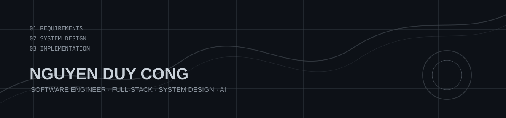

  

<h1 align="center">Hi 👋, I'm Công</h1>

  <strong>Software Engineer</strong>

  <code>Full-stack · System Design · AI</code>

  Building software from <strong>requirements → business rules → system design → implementation</strong>.

---

<h2 align="center">🚀 About Me</h2>

  Final-year Software Engineering student at FPT University. 
  I enjoy building systems where engineering decisions, business rules, and user needs have to work together.

  My goal is simple: design clean systems, write reliable code, and grow into a 
  <strong>Development Lead</strong> who can take a project from idea to production.

---

<h2 align="center">🤝 Connect</h2>

  
  
  

---

<h2 align="center">💻 Tech Stack</h2>

  

  Java · Spring Boot · Node.js · React · Next.js · TypeScript · PostgreSQL · MySQL · SQL Server · Supabase · Elasticsearch

  <strong>Engineering Interests:</strong> 
  Backend Architecture · Full-stack Systems · Requirements Engineering · Database Design · UML · AI / RAG

---

<h2 align="center">📌 Featured Projects</h2>

<table align="center">
  <tr>
    <td width="50%" valign="top">
      <h3>EV Charging Station Management System</h3>
      
Full-stack platform for charging stations, reservations, payments, authentication, and operational management.

      
<strong>Team Lead · System Design · Backend · Frontend · Database</strong>

      <a href="https://github.com/KOKONOI1706/EV-Charging-Station-Management-System-BE">View project →</a>
    </td>
    <td width="50%" valign="top">
      <h3>FU Charging Marketplace</h3>
      
University marketplace concept with identity, moderation, reservation, and deposit workflows for peer-to-peer trading.

      
<strong>Business Rules · Requirements · System Design · Full-stack</strong>

      <a href="https://github.com/KOKONOI1706/fu-swap-spot">View project →</a>
    </td>
  </tr>
</table>

---

<h2 align="center">📊 GitHub Stats</h2>

  
  

---

<h2 align="center">📈 Activity Graph</h2>

  

  

---

<h2 align="center">🎯 Currently Building Toward</h2>

  <strong>Software Engineer → System Designer → Development Lead</strong>

